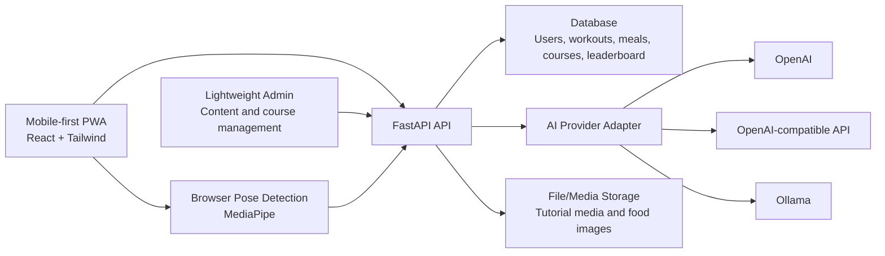

# Smart Gym Design

Date: 2026-06-05

## Goal

Build a mobile-first smart gym product as a production-oriented prototype. The first version should provide a complete user journey across personal fitness space, AI coaching, editable workout plans, editable meal plans, workout tracking, leaderboard, pose-based exercise evaluation, tutorials, and lightweight content management.

The system prioritizes real product structure over a shallow demo, while keeping implementation scope controlled.

## Confirmed Direction

- First version style: complete prototype with all major modules present.
- Product target: production-ready foundation, not only a course demo.
- Stack direction: Python FastAPI backend and React mobile-first PWA frontend.
- Frontend route: PWA first, later expandable to a native app.
- AI depth: real LLM/API calls, not only templates.
- AI providers: OpenAI, OpenAI-compatible endpoints, and Ollama.
- User isolation: personal data is private; leaderboard only exposes public profile and score fields.
- Pose detection: hybrid model. Browser handles real-time detection; backend stores results and triggers AI analysis.
- Roles: normal user, AI coach virtual role, and lightweight administrator.
- Content management: administrator can manage exercise library, tutorials, courses, and exercise rules.
- Wearable integration: lowest priority, with data model and import interface reserved.

## Architecture

Use a single FastAPI backend with clear internal modules. The first version is deployed as one backend service, but module boundaries should allow later extraction of AI or vision services.

Core architecture rules:

- User-facing experience is mobile-first.
- Admin is lightweight and content-focused.
- Backend enforces all user data isolation.
- Leaderboard reads public score data, not private training records.
- AI is accessed through one service abstraction.
- Pose detection runs in the browser for real-time feedback; backend handles persistence and analysis.

## Modules

### auth

Handles registration, login, JWT, current user resolution, and role checks.

### users

Stores user account, profile, avatar, body data, goals, training frequency, and nutrition preferences.

### workouts

Handles workout modes, workout sessions, training duration, calories, completion status, pose score, and history.

### leaderboard

Computes and exposes public rankings. It only returns display name, avatar, score type, score value, rank, and period.

### ai_coach

Generates workout plans, meal plans, post-workout summaries, nutrition advice, pose improvement suggestions, and conversation-based plan edits.

### nutrition

Handles food image recognition, calorie estimation, meal logs, nutrition summaries, and AI meal recommendations.

### pose

Receives pose detection results, stores metrics, applies configured exercise rules, and prepares summaries for AI analysis.

### content

Manages exercise library, tutorials, courses, media references, difficulty, target muscles, and pose evaluation rule configuration.

### admin

Provides content, course, exercise, workout mode, and publish-status management.

### devices

Reserves wearable and heart-rate data models and import APIs. Real hardware integration is low priority.

## User Flows

### Registration and profile setup

The user registers, logs in, and fills body data, goals, preferences, and available training frequency.

### AI workout planning

The user asks the AI coach to generate a workout plan. The backend summarizes profile and training history, calls `AIService`, stores the generated plan, and marks it as AI-generated.

The plan must be editable. The user can change training days, exercises, sets, duration, mode, and notes. The user can also ask AI to adjust the plan through conversation. The system stores the active version and version history.

### Training

The user starts a workout from a plan or workout mode. Every workout has an entry to enable pose detection.

When pose detection is enabled, the browser captures camera input, runs MediaPipe, shows real-time feedback, counts repetitions when rules exist, and computes basic score. For exercises without configured rules, the system still allows detection but only stores basic pose and workout metrics.

### Workout result and AI review

The frontend submits duration, metrics, pose score, calorie estimate, completion status, and exercise details. The backend stores the result for the current user only. AI generates a private post-workout review and next-step suggestions.

### Leaderboard

The backend calculates public rankings by period and score type, such as weekly duration, total calories, or consecutive training days. The leaderboard must not expose private workout details.

### AI meal planning

The user asks AI to generate meal plans. The generated plan is editable. The user can use conversation to change meal plans, such as excluding foods, lowering carbohydrates, increasing protein, or adjusting budget. The active meal plan and history are stored.

### Food recognition

The user uploads a food image. The system uses a provider with vision capability when available. If the current provider does not support vision, the feature falls back to text-based user description and manual correction.

### Content management

Administrators manage exercises, tutorials, courses, media links, publish status, and pose rule configuration.

## Data Isolation and Permissions

Roles:

- Normal user: can access only their own profile, plans, meals, workouts, AI conversations, and pose results.
- Administrator: can manage content and configuration. Administrators do not automatically get access to private user workout or nutrition details.

Isolation rules:

- Private tables include `user_id`.
- Backend injects user identity from token and never trusts client-supplied `user_id` for private data access.
- Leaderboard uses a public score table or snapshot.
- AI requests send only the required summary by default, not complete private history.

## Core Data Model

- `users`: account, nickname, avatar, role, status.
- `user_profiles`: body data, fitness goal, training frequency, dietary preferences.
- `workout_modes`: supported exercise modes.
- `exercise_library`: exercise name, muscles, difficulty, tutorial, media, pose rule config.
- `training_plans`: workout plan metadata, owner, source, active version.
- `training_plan_items`: planned days, exercises, sets, duration, notes.
- `meal_plans`: meal plan metadata, owner, source, active version.
- `meal_plan_items`: meals, foods, calories, nutrition targets, notes.
- `workout_sessions`: workout records.
- `workout_session_metrics`: duration, calories, reps, pose score, heart rate summary, custom metrics.
- `nutrition_logs`: food records, image reference, calories, nutrients, AI confidence, user corrections.
- `ai_conversations`: topic, owner, related plan or workout.
- `ai_messages`: message role, content, provider metadata.
- `leaderboard_snapshots`: period, score type, public profile, score, rank.
- `device_metrics`: wearable or simulated heart-rate metrics.

Plans and meal plans use versioning so AI generation, user edits, and AI conversation changes do not overwrite each other unexpectedly.

## AI Design

Use a unified `AIService` with provider adapters:

- `OpenAIProvider`
- `OpenAICompatibleProvider`
- `OllamaProvider`

Business modules call use-case methods such as:

- Generate workout plan.
- Modify workout plan through conversation.
- Generate meal plan.
- Modify meal plan through conversation.
- Analyze workout result.
- Analyze pose evaluation.
- Recognize food and estimate calories.
- Generate nutrition advice.

Provider-specific request formatting, model names, API keys, base URLs, and streaming behavior remain inside the adapter layer.

## Pose Detection Design

The browser is responsible for:

- Camera access.
- MediaPipe pose landmark detection.
- Real-time visual feedback.
- Repetition counting when rules exist.
- Basic score display.

The backend is responsible for:

- Receiving results.
- Storing workout and pose metrics.
- Applying or validating configured rules when needed.
- Triggering AI analysis.
- Returning historical reports.

Exercise-specific rules live in `exercise_library`, including angle thresholds, count states, mistake labels, and coaching messages.

## Wearable Data

Wearable support is reserved but low priority. The first version includes:

- `device_metrics` model.
- Manual or simulated heart-rate data import.
- API shape for future heart rate, calories, sleep, and recovery metrics.

Real device protocol integration is deferred.

## Product Pages

### User PWA

- Home / today plan: training, meal plan, AI reminder, quick start.
- AI coach: conversation for workout, meal, and training advice.
- Training: workout modes, planned workouts, tutorials, timer, pose detection entry.
- Pose detection: camera, live feedback, counter, score, tips.
- Workout plan: week/day view, edit plan, replace exercises, AI rearrange.
- Nutrition: AI meal plan, food image recognition, intake log, nutrition overview.
- Leaderboard: weekly and monthly rankings.
- Profile: body data, goals, preferences, settings.

### Admin

- Exercise library management.
- Course and tutorial management.
- Workout mode management.
- Publish and unpublish content.
- Pose rule configuration.

## Error Handling

- AI provider failure should not block manual editing.
- Provider configuration errors should be visible to administrators or developers; normal users see a simple unavailable state.
- Food recognition uncertainty should allow manual correction.
- Camera or pose detection failure should still allow normal workout recording.
- Leaderboard failures should not affect private workout saving.
- All private APIs must enforce current-user filtering.

## Testing Focus

- Authentication and role checks.
- User data isolation.
- Plan and meal versioning.
- Leaderboard desensitization.
- AI provider adapters.
- Pose result ingestion.
- Content publish and unpublish flow.
- Admin-only content mutation.

## MVP Phases

### Phase 1: Platform skeleton

Registration, login, profile, authorization, PWA shell, admin shell.

### Phase 2: Training and leaderboard

Workout modes, workout records, public leaderboard, exercise and tutorial content management.

### Phase 3: AI plans and meals

AI provider abstraction, workout plan generation, editable workout plans, meal plan generation, editable meal plans, conversation-based changes.

### Phase 4: Pose detection

Frontend MediaPipe, detection entry for all workouts, result saving, AI pose suggestions.

### Phase 5: Food recognition and wearable reserve

Food image recognition, calorie estimation, wearable data model, simulated heart-rate import.

## Open Implementation Decisions

- Database choice should be finalized during implementation planning. PostgreSQL is preferred for a production-oriented prototype; SQLite can be used only for very early local scaffolding.
- File storage can start local and later move to object storage.
- Admin and user PWA can be one React app with route separation or two frontends. This should be decided in the implementation plan.
- AI provider configuration can initially be environment-based, with admin UI added later if needed.
