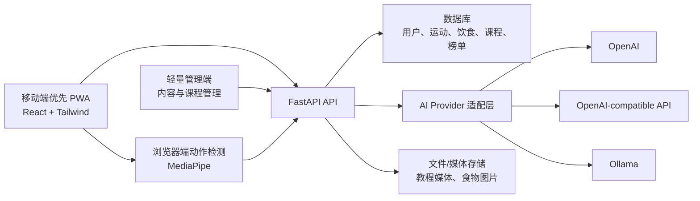

# 智慧健身房设计规格

日期：2026-06-05

## 目标

构建一个移动端优先、具备可上线产品雏形的智慧健身房系统。第一版需要形成完整用户闭环，覆盖个人健身空间、AI 教练、可编辑训练课表、可编辑 AI 食谱、运动记录、运动榜单、动作检测评估、动作教程，以及轻量内容管理。

系统应优先保证产品结构真实、模块边界清楚、后续可扩展，同时控制第一版实现范围，避免一次性把所有能力做成重工程。

## 已确认方向

- 第一版形态：完整原型，主要模块都有入口和基础闭环。
- 产品目标：可上线产品雏形，而不是单纯课程演示。
- 技术栈：Python FastAPI 后端，React 移动端优先 PWA 前端。
- 前端路线：先做 PWA，后续可扩展为原生 App。
- AI 深度：真实调用大模型/API，不只做模板模拟。
- AI Provider：支持 OpenAI、OpenAI-compatible endpoint、Ollama。
- 用户隔离：个人数据私有，榜单只展示公开身份和成绩字段。
- 动作检测：混合方案，浏览器负责实时检测，后端保存结果并触发 AI 分析。
- 角色：普通用户、AI 教练虚拟角色、轻量管理员。
- 内容管理：管理员可维护动作库、教程、课程和动作检测规则。
- 手环接入：最低优先级，第一版只预留数据模型和导入接口。

## 总体架构

第一版采用单体 FastAPI 后端，但内部按领域模块拆分。部署上先保持一个后端服务，代码边界上为后续拆分 AI 服务或视觉分析服务预留空间。

核心架构规则：

- 用户端体验以移动端为主。
- 管理端保持轻量，聚焦内容和配置。
- 后端强制执行所有用户数据隔离。
- 榜单读取公开成绩数据，不直接暴露私有训练记录。
- AI 能力统一通过服务抽象访问。
- 动作检测在浏览器端提供实时反馈，后端负责持久化和分析。

## 模块设计

### auth

负责注册、登录、JWT、当前用户解析和角色校验。

### users

负责用户账号、资料、头像、身体基础数据、健身目标、训练频率和饮食偏好。

### workouts

负责运动模式、训练记录、训练时长、消耗估算、完成状态、动作评分和历史趋势。

### leaderboard

负责计算并暴露公开榜单。接口只返回昵称、头像、成绩类型、成绩值、排名和周期。

### ai_coach

负责 AI 课表生成、AI 食谱生成、训练复盘、饮食建议、动作改进建议，以及对话式修改课表和食谱。

### nutrition

负责食物图片识别、热量估算、饮食记录、营养摘要和 AI 饮食推荐。

### pose

负责接收动作检测结果、保存动作指标、应用动作评分规则，并为 AI 分析准备摘要数据。

### content

负责动作库、教程、课程、媒体链接、难度、目标肌群和动作检测规则配置。

### admin

负责内容、课程、动作、运动模式和发布状态管理。

### devices

预留手环和心率数据模型及导入 API。真实硬件接入放低优先级。

## 用户流程

### 注册与资料设置

用户注册登录后填写身体数据、健身目标、偏好和可训练频率。

### AI 生成训练课表

用户让 AI 教练生成训练课表。后端汇总用户资料和训练历史，调用 `AIService`，保存生成结果，并标记为 AI 生成。

课表必须可编辑。用户可以修改训练日、动作、组数、时长、运动模式和备注，也可以通过对话要求 AI 调整课表。系统保存当前生效版本和历史版本。

### 开始训练

用户可以从课表或运动模式开始训练。所有训练都提供动作检测入口。

如果用户开启动作检测，浏览器调用摄像头并运行 MediaPipe，显示实时反馈；当动作配置了规则时，系统进行计数和基础评分。对于暂未配置规则的动作，仍允许进入检测，但只保存基础姿态和训练指标。

### 训练结果与 AI 复盘

前端提交训练时长、指标、动作评分、消耗估算、完成状态和动作明细。后端只为当前登录用户保存结果。AI 根据训练摘要生成私有复盘和后续建议。

### 运动榜单

后端按周期和成绩类型计算公开排名，例如周运动时长、累计消耗、连续训练天数。榜单不得暴露用户私有训练明细。

### AI 生成食谱

用户可以让 AI 生成食谱。生成后的食谱可编辑。用户也可以通过对话修改食谱，例如“不吃牛肉”“晚餐低碳”“增加蛋白质”“预算低一点”。系统保存当前食谱和历史版本。

### 食物识别

用户上传食物图片。系统优先使用支持视觉能力的 AI Provider 识别食物并估算热量。如果当前 Provider 不支持视觉能力，则退化为文本描述识别和用户手动修正。

### 内容管理

管理员维护动作、教程、课程、媒体链接、发布状态和动作检测规则。

## 数据隔离与权限

角色：

- 普通用户：只能访问自己的资料、课表、食谱、训练记录、AI 对话和动作检测结果。
- 管理员：可以管理内容和配置，但默认不能查看用户私有训练或饮食明细。

隔离规则：

- 私有数据表必须包含 `user_id`。
- 后端从 token 注入当前用户身份，不能信任前端传入的 `user_id` 访问私有数据。
- 榜单使用独立公开成绩表或榜单快照。
- AI 请求默认只传必要摘要，不传完整私有历史。

## 核心数据模型

- `users`：账号、昵称、头像、角色、状态。
- `user_profiles`：身体数据、健身目标、训练频率、饮食偏好。
- `workout_modes`：支持的运动模式。
- `exercise_library`：动作名称、目标肌群、难度、教程、媒体、动作检测规则配置。
- `training_plans`：训练课表元数据、所属用户、来源、当前生效版本。
- `training_plan_items`：训练日、动作、组数、时长、备注。
- `meal_plans`：食谱元数据、所属用户、来源、当前生效版本。
- `meal_plan_items`：餐次、食物、热量、营养目标、备注。
- `workout_sessions`：训练记录。
- `workout_session_metrics`：训练时长、消耗、次数、动作评分、心率摘要、自定义指标。
- `nutrition_logs`：食物记录、图片引用、热量、营养素、AI 置信度、用户修正。
- `ai_conversations`：对话主题、所属用户、关联课表或训练。
- `ai_messages`：消息角色、内容、Provider 元数据。
- `leaderboard_snapshots`：周期、成绩类型、公开身份、成绩、排名。
- `device_metrics`：手环或模拟心率指标。

训练课表和食谱都采用版本化设计，避免 AI 生成、用户手动编辑、AI 对话修改互相覆盖。

## AI 设计

使用统一 `AIService` 和 Provider 适配器：

- `OpenAIProvider`
- `OpenAICompatibleProvider`
- `OllamaProvider`

业务模块调用用例级方法，例如：

- 生成训练课表。
- 通过对话修改训练课表。
- 生成食谱。
- 通过对话修改食谱。
- 分析训练结果。
- 分析动作检测结果。
- 识别食物并估算热量。
- 生成饮食建议。

Provider 相关的请求格式、模型名称、API Key、Base URL、流式输出行为都封装在适配层内部。

## 动作检测设计

浏览器端负责：

- 摄像头访问。
- MediaPipe 姿态关键点检测。
- 实时视觉反馈。
- 有规则动作的次数统计。
- 基础评分展示。

后端负责：

- 接收检测结果。
- 保存训练和动作指标。
- 必要时应用或校验动作规则。
- 触发 AI 分析。
- 返回历史报告。

动作规则存放在 `exercise_library`，包括角度阈值、计数状态、错误标签和指导提示。

## 手环数据

手环支持只做低优先级预留。第一版包含：

- `device_metrics` 数据模型。
- 手动或模拟心率数据导入。
- 为未来心率、消耗、睡眠和恢复指标预留 API 形态。

真实设备协议接入延后。

## 产品页面

### 用户端 PWA

- 首页 / 今日计划：今日训练、今日食谱、AI 提醒、快速开始。
- AI 教练：训练、饮食、复盘建议的对话入口。
- 训练：运动模式、课表训练、教程、计时器、动作检测入口。
- 动作检测：摄像头、实时反馈、计数、评分、提示。
- 课表：周视图/日视图，编辑计划、替换动作、AI 重新安排。
- 饮食：AI 食谱、食物图片识别、摄入记录、营养概览。
- 榜单：周榜、月榜。
- 我的：身体数据、目标、偏好、设置。

### 管理端

- 动作库管理。
- 课程和教程管理。
- 运动模式管理。
- 内容发布和下架。
- 动作检测规则配置。

## 错误处理

- AI Provider 失败时，不能阻塞用户手动编辑。
- Provider 配置错误时，管理员或开发者能看到明确错误；普通用户只看到“AI 教练暂不可用”。
- 食物识别不确定时，允许用户手动修正。
- 摄像头或动作检测失败时，仍允许普通训练记录。
- 榜单统计失败时，不影响私有训练保存。
- 所有私有 API 必须强制执行当前用户过滤。

## 测试重点

- 认证和角色校验。
- 用户数据隔离。
- 课表和食谱版本化。
- 榜单脱敏。
- AI Provider 适配层。
- 动作检测结果接收。
- 内容发布和下架流程。
- 管理员专属内容变更。

## MVP 分期

### 第 1 期：平台骨架

注册、登录、用户资料、权限、PWA 壳、管理端壳。

### 第 2 期：训练与榜单

运动模式、训练记录、公开榜单、动作和教程内容管理。

### 第 3 期：AI 课表与食谱

AI Provider 抽象、训练课表生成、训练课表编辑、食谱生成、食谱编辑、对话式修改。

### 第 4 期：动作检测

前端 MediaPipe、所有训练的检测入口、结果保存、AI 动作建议。

### 第 5 期：食物识别与手环预留

食物图片识别、热量估算、手环数据模型、模拟心率导入。

## 待实现计划阶段确认的事项

- 数据库选择：生产雏形优先 PostgreSQL；极早期本地脚手架可临时使用 SQLite。
- 文件存储：可先本地存储，后续迁移到对象存储。
- 管理端和用户端：可以先放在一个 React 应用内做路由隔离，也可以拆成两个前端；在实现计划阶段确认。
- AI Provider 配置：第一版可先通过环境变量配置，后续再加管理界面。
